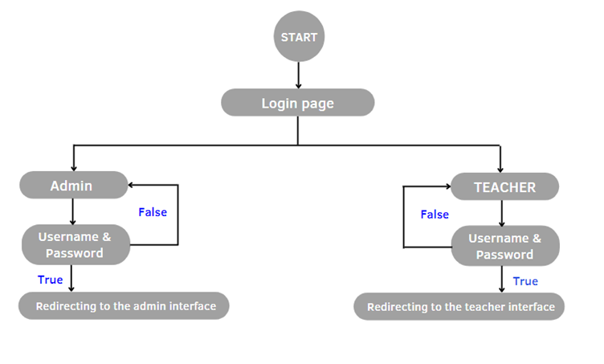
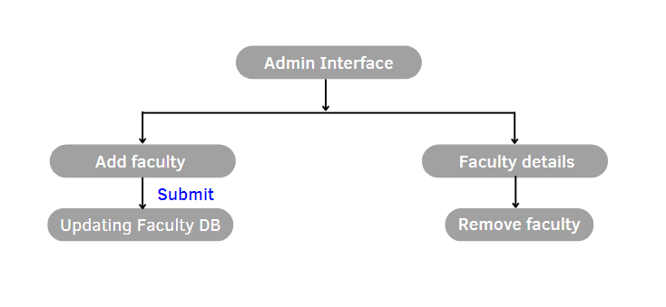
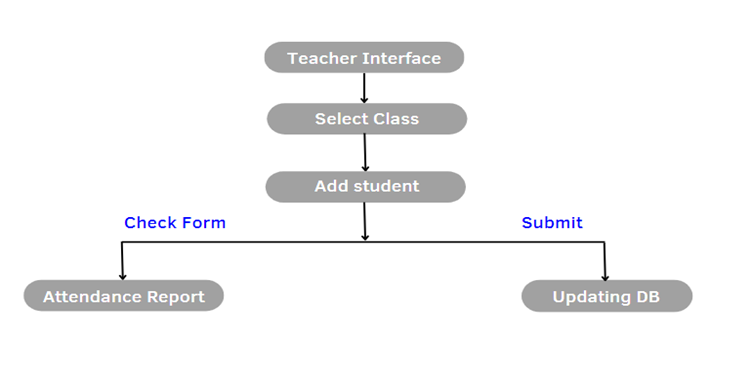

# TimeDesk - Attendance Management System

TimeDesk is an **admin-teacher** interface that eases the way of marking attendance of students.   
There are two interfaces:
- **Admin**: The Admin registers the teacher's details into the system and provide them with TimeDesk Access.
- **Teacher**: The teacher after receiving access rights through login & password can proceed with class attendance.
 

## Tech Stack

  
  
  
  
  
  

 

  
Frontend: HTML, CSS, JS, BOOTSTRAP

  
Backend: PHP

  
Database: MySQL

 

## ETC - Estimated Time to Complete
Duration: 2 months
 

## Block Diagrams

  <h3># LOGIN INTERFACE</h3>
  

 

  <h3># ADMIN INTERFACE</h3>
  

 

  <h3># TEACHER INTERFACE</h3>
  

 

## Snapshots
# Login Page

   
  <i>Fig: Login 1.1</i>
   
   
   
  <i>Fig: Login 1.2</i>

  

# Admin Page

   
  <i>Fig: Admin 1.1</i>
   
   
   
  <i>Fig: Admin 1.2</i>

